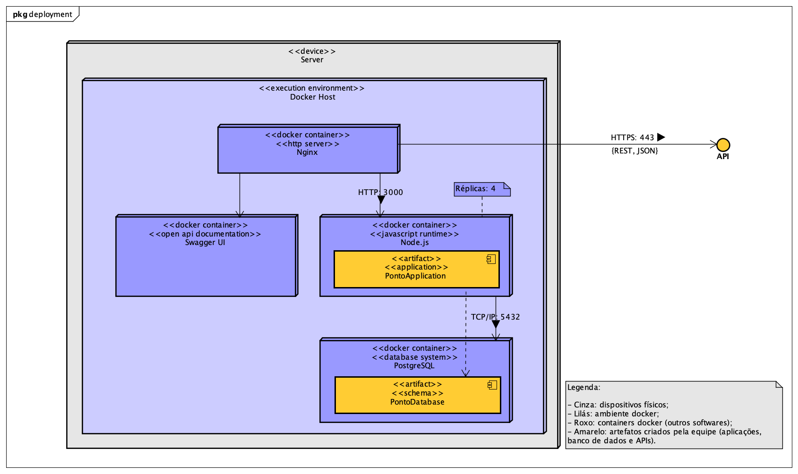

<div align="center">


Aplicação para registro de ponto e monitoramento de jornadas de trabalho


</div>

## :eyes: Visão geral
O **W3 Ponto** é uma aplicação de ponto eletrônico para empresas e funcionários que precisam ter o controle sobre o banco de horas e jornadas de trabalho.

Com o **W3 Ponto** é muito fácil e prático realizar o registro de pontos, funcionários, turnos de trabalho e muito mais.

## :books: Arquitetura

### Diagrama de entidade e relacionamento


### Diagrama de implantação


## :runner: Utilização

### Requisitos
- [Docker](https://docs.docker.com/engine/install/)
- [Docker compose](https://docs.docker.com/compose/install/)

### Passo a passo

Com os requisitos devidamente instalados e configurados em sua máquina, siga os passos a seguir para executar a aplicação.

```bash
# crie uma cópia local do repositório:
git clone https://github.com/WeWillWin-W3/ponto.git

# acesse o diretório principal do projeto:
cd ponto

# crie o arquivo configuração da api:
cp ./api/.env.example ./api/.env

# crie o arquivo de configuração do database:
cp ./database/.env.example ./database/.env

# execute os serviços:
docker-compose up --scale api=4
```

Após concluir os passos anteriores, os seguintes recursos ficarão disponíveis:

- **Documentação dos endpoints (swagger):** https://localhost/docs/v1/
- **Documentação dos endpoints (open api):** https://localhost/docs/v1/openapi.yml
- **Enpoints da aplicação (api):** https://localhost/v1/*

### Como utilizar outros clientes de APIs
Caso você não tenha muita experiência com o Swagger ou prefira utilizar outro cliente de APIs como [Postman](https://www.postman.com/) ou [Insomnia](https://insomnia.rest/) é possível configurar tais ferramentas facilmente. Para isso, importe o arquivo `docs/openapi.yml` na sua ferramenta preferida e tenha acesso ao ambiente configurado para os testes.
